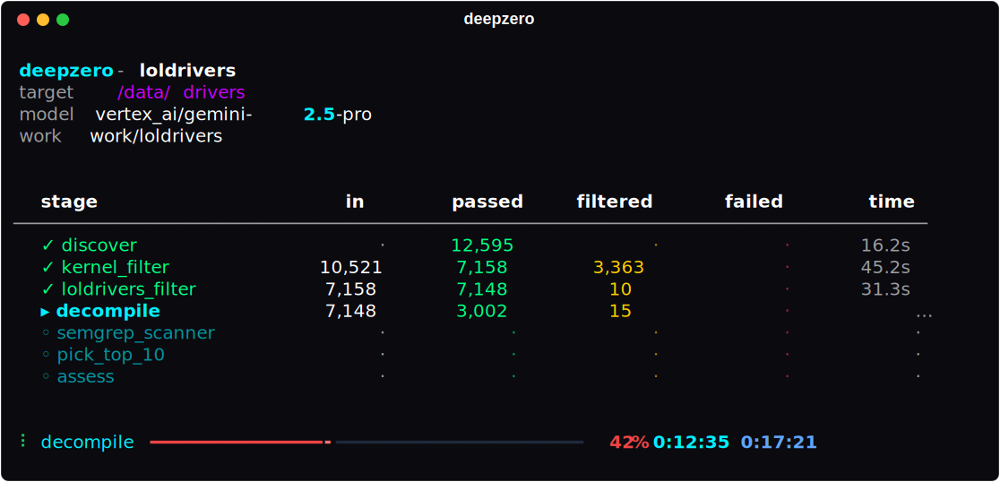

<div align="center">
  <br>
  
  <br><br>
  <p><b>Automated vulnerability research pipeline engine</b></p>
  <p>Define pipelines as YAML. DeepZero handles orchestration, parallelism, fault tolerance, and state.</p>
  <p>
    <a href="https://github.com/416rehman/DeepZero/actions"></a>
    <a href="https://github.com/416rehman/DeepZero/blob/main/LICENSE"></a>
    
    
  </p>
</div>

<br>

<div align="center">
  
</div>

<br>

- 🔗 **Pipeline-as-YAML** - chain ingest, filter, transform, and LLM-assess stages declaratively
- ⚡ **Parallel execution** - ThreadPoolExecutor with configurable concurrency per stage
- 💾 **Resumable runs** - atomic per-sample state on disk; Ctrl+C and re-run to pick up where you left off
- 🤖 **LLM integration** - Jinja2 prompt templates with any LLM provider via [LiteLLM](https://github.com/BerriAI/litellm)
- 🌐 **REST API** - query run state and sample data over HTTP
- 🧩 **Extensible** - write custom processors as Python classes, reference them by path in YAML

<details>
<summary><b>📑 Table of Contents</b></summary>

- [⚡️ Quickstart](#️-quickstart)
- [⚙️ Architecture](#️-architecture)
- [📦 Installation](#-installation)
- [🚀 CLI Reference](#-cli)
- [📝 Pipeline Syntax](#-pipeline-syntax)
- [🛠 Shipped Processors](#-shipped-processors)
- [🔌 Writing Custom Processors](#-writing-custom-processors)

</details>

<br>

## ⚡️ Quickstart

DeepZero requires a target corpus of files to analyze and a pipeline configuration detailing how to process them. We provide a complete example pipeline designed to hunt for vulnerabilities in Windows kernel drivers using the LOLDrivers dataset as a blocklist.

1. **Download a sample corpus**
   For this example, we will use the open-source Snappy Driver Installer (SDI) driver pack which contains thousands of real-world Windows drivers:
   👉 **[https://sdi-tool.org/download/](https://sdi-tool.org/download/)**
   
   Download the standard/torrent package and extract the archive to a local path (e.g., `C:\drivers`).

2. **Run the LOLDrivers pipeline**
   Pass your driver path to the CLI, alongside the provided pipeline definition:
   ```bash
   deepzero run C:\drivers -p .\pipelines\loldrivers\pipeline.yaml
   ```

3. **Monitor progress and state**
   DeepZero will safely parallelize execution, cache intermediate outputs, and show a live terminal dashboard. If you need to stop unexpectedly, simply press `Ctrl+C`. Re-run the exact same command later, and DeepZero will instantly resume from disk state.

---

## ⚙️ Architecture

Every pipeline starts with one **Ingest** processor, followed by any sequence of **Map**, **BulkMap**, and **Reduce** processors. Each type has different input/output semantics and different control over whether a sample continues downstream.

### Ingest — `source → N samples`

The first stage in every pipeline. Receives a target path (file or directory), discovers samples, and returns them as a list. Each sample gets a unique ID, a source path, and initial metadata.

```
target directory ──▶ [ IngestProcessor ] ──▶ sample_a, sample_b, sample_c, ...
```

- **Input:** `(ctx: ProcessorContext, target: Path)`
- **Output:** `list[Sample]` — each Sample has a `sample_id`, `source_path`, `filename`, and `data` dict
- **Outcome:** every returned Sample enters the pipeline as an active sample

### Map — `1 sample → 1 result`

Processes one sample at a time. The engine parallelizes Map processors across a ThreadPoolExecutor. Must be thread-safe.

```
sample_a ──▶ [ MapProcessor ] ──▶ ok       → sample continues downstream
sample_b ──▶ [ MapProcessor ] ──▶ filter   → sample is dropped (intentionally excluded)
sample_c ──▶ [ MapProcessor ] ──▶ fail     → sample is dead (processing error)
```

- **Input:** `(ctx: ProcessorContext, entry: ProcessorEntry)`
- **Output:** `ProcessorResult` — one of three outcomes:
  - `ProcessorResult.ok(data={...}, artifacts={...})` — sample passes, continues to the next stage
  - `ProcessorResult.filter("reason")` — sample is intentionally excluded from further processing
  - `ProcessorResult.fail("error")` — sample failed, marked as errored
- **Use for:** filtering, decompilation, LLM analysis, metadata extraction, shell commands

### BulkMap — `N samples → N results`

All active samples are passed to a single external process invocation. More efficient than Map when the tool has high startup cost (e.g. semgrep). Returns one result per input entry, matched by index.

```
┌ sample_a ┐                                ┌ ok     ┐
│ sample_b │ ──▶ [ BulkMapProcessor ] ──▶  │ filter │  (one process, all samples)
│ sample_c │                                │ ok     │
└──────────┘                                └────────┘
```

- **Input:** `(ctx: ProcessorContext, entries: list[ProcessorEntry])`
- **Output:** `list[ProcessorResult]` — one result per entry, same three outcomes as Map (ok / filter / fail)
- **Use for:** semgrep batch scanning, bulk static analysis, batch API calls

### Reduce — `N samples → M survivors`

Sees all active samples at once. Returns a list of sample IDs to keep, in the desired order. Everything not returned is filtered out. This is a global synchronization barrier — the engine cannot parallelize or chunk it.

```
┌ sample_a ┐                               ┌ sample_c ┐
│ sample_b │ ──▶ [ ReduceProcessor ] ──▶  │ sample_a │  (sample_b dropped, order changed)
│ sample_c │                               └──────────┘
└──────────┘
```

- **Input:** `(ctx: ProcessorContext, entries: list[ProcessorEntry])`
- **Output:** `list[str]` — sample IDs to keep, in order. Anything not in this list is filtered out.
- **Use for:** top-k selection, sorting by priority, deduplication, global ranking

---

## 📦 Installation

Requires **Python 3.11+**.

```bash
git clone https://github.com/416rehman/DeepZero.git
cd DeepZero

# install with all optional extras
pip install -e ".[full]"

# or install only what you need
pip install -e ".[llm]"    # LLM support via litellm
pip install -e ".[pe]"     # PE header parsing via lief
pip install -e ".[serve]"  # REST API server (starlette + uvicorn)

# copy and populate environment variables
cp .env.example .env
```

### Core Dependencies

| Package | Purpose |
|---------|---------|
| `click` | CLI framework |
| `rich` | Terminal UI, progress bars, live dashboard |
| `pyyaml` | Pipeline YAML parsing |
| `jinja2` | LLM prompt templating |

### Optional Dependencies

| Extra | Package | Purpose |
|-------|---------|---------|
| `llm` | `litellm` | LLM provider abstraction (OpenAI, Anthropic, Vertex AI, etc.) |
| `pe` | `lief` | PE header parsing for the `pe_ingest` processor |
| `serve` | `starlette`, `uvicorn` | REST API server |

---

## 🚀 CLI

```bash
# run a pipeline against a target directory or file
deepzero run ./targets -p pipelines/loldrivers/pipeline.yaml

# resume a previous run (just re-run the same command without --clean)
deepzero run ./targets -p pipelines/loldrivers/pipeline.yaml

# start fresh, deleting previous run data
deepzero run ./targets -p pipelines/loldrivers/pipeline.yaml --clean

# check run status
deepzero status -p loldrivers

# validate a pipeline definition without executing it
deepzero validate loldrivers

# list all registered built-in processors
deepzero list-processors

# scaffold a new pipeline
deepzero init my_pipeline

# LLM-backed interactive analysis REPL over run data
deepzero interactive -m openai/gpt-4o -w work

# start the REST API server
deepzero serve --host 127.0.0.1 --port 8420 -w work/
```

### `deepzero run`

| Flag | Description |
|------|-------------|
| `TARGET` | Path to a file or directory to analyze (required, positional) |
| `-p`, `--pipeline` | Pipeline name, directory, or YAML file path (required) |
| `-m`, `--model` | Override the LLM model string from the pipeline YAML |
| `-w`, `--work-dir` | Override the work directory from the pipeline YAML |
| `-v`, `--verbose` | Enable debug logging |
| `--clean` | Delete previous run data before starting |

Resume is automatic. If a `work/<pipeline>/` directory exists with prior state, `deepzero run` resumes from where it left off. Use `--clean` to discard and restart.

### `deepzero serve`

Starts a read-only REST API (Starlette + Uvicorn) for querying run state and sample data.

| Endpoint | Method | Description |
|----------|--------|-------------|
| `/api/health` | GET | Health check |
| `/api/runs` | GET | List runs |
| `/api/run` | GET | Current run state |
| `/api/samples` | GET | List samples (filterable by `?verdict=`, `?stage=`, `?status=`) |
| `/api/samples/{id}` | GET | Full sample state with history |
| `/api/samples/{id}/artifacts/{name}` | GET | Read a named artifact |

---

## 🛠 Pipeline YAML

```yaml
name: my_pipeline
description: custom vulnerability research pipeline
version: "1.0"

# litellm model string, required for any generic_llm stage
model: openai/gpt-4o

settings:
  work_dir: work      # relative to cwd, final path is work/<pipeline_name>/
  max_workers: 4       # default concurrency for stages that don't specify parallel

stages:
  # first stage is always an IngestProcessor
  - name: discover
    processor: file_discovery
    config:
      extensions: ["*"]
      recursive: true

  # map processor, 1:1 per-sample filtering
  - name: filter
    processor: metadata_filter
    config:
      require:
        is_executable: true
      dedup_field: sha256

  # external processor from the processors/ directory
  - name: decompile
    processor: ghidra_decompile/ghidra_decompile.py
    parallel: 4
    timeout: 300
    on_failure: skip
    config:
      strategy: extract_dispatch.py
      ghidra_install_dir: ${GHIDRA_INSTALL_DIR}    # env-var expansion
      java_home: ${JAVA_HOME:-}                     # with default

  # bulk_map processor, one process scans all samples
  - name: scan
    processor: semgrep_scanner/semgrep_scanner.py
    config:
      min_findings: 1
      rules_dir: pipelines/my_pipeline/rules

  # reduce processor, keeps top N
  - name: pick_top_20
    processor: top_k
    config:
      metric_path: "scan.finding_count"
      keep_top: 20
      sort_order: desc

  # map processor, LLM deep analysis
  - name: assess
    processor: generic_llm
    parallel: 2
    on_failure: skip
    config:
      prompt: pipelines/my_pipeline/prompt.j2
      output_file: assessment.md
      classify_by: "\\[VULNERABLE\\]|\\[SAFE\\]"
      max_context_tokens: 900000
      max_retries: 3
```

### Stage Options

| Field | Type | Default | Description |
|-------|------|---------|-------------|
| `name` | string | required | Unique stage name within the pipeline |
| `processor` | string | required | Processor reference (see below) |
| `config` | dict | `{}` | Processor-specific configuration |
| `parallel` | int | `4` | Concurrency for Map processors. `0` auto-scales to `os.cpu_count()` |
| `timeout` | int | `0` | Per-sample timeout in seconds (0 = no timeout) |
| `on_failure` | string | `skip` | `skip`, `retry`, or `abort` |
| `max_retries` | int | `0` | Retry count when `on_failure: retry` |

### Processor Resolution

```yaml
processor: metadata_filter                  # built-in (bare name, must match registry)
processor: my_dir/my_proc.py               # processors/my_dir/my_proc.py, auto-detect class
processor: my_dir/my_proc.py:MyClass       # specific class in that file
processor: my.python.module:MyClass        # dotted Python import path
```

Resolution order: path with `/` → processors/ directory lookup, bare name → built-in registry, name with `:` → dotted Python import.

### Environment Variable Expansion

All string values in the YAML `config` section support `${VAR}` and `${VAR:-default}` syntax. Variables are expanded from the process environment before parsing.

---

## 🔧 Built-in Processors

| Name | Type | Description |
|------|------|-------------|
| `file_discovery` | Ingest | Finds files by extension with optional recursion, computes SHA256 per file |
| `metadata_filter` | Map | Field equality checks, min/max thresholds, deduplication on any data field |
| `hash_exclude` | Map | Hash-based exclusion from inline lists or file, optional dedup, configurable hash field |
| `generic_llm` | Map | Jinja2 prompt template → LLM (via litellm) → writes output file, optional regex classification |
| `generic_command` | Map | Runs any shell command as a pipeline stage with template variable substitution |
| `top_k` | Reduce | Keeps the top N samples ranked by an upstream numeric metric, filters the rest |
| `sort` | Reduce | Reorders all samples by an upstream numeric metric without filtering |

Run `deepzero list-processors` to see all registered processors and their types.

---

## 🔌 Building Processors

Subclass one of the four base classes:

```python
from deepzero.engine.stage import MapProcessor, ProcessorContext, ProcessorEntry, ProcessorResult
from dataclasses import dataclass


class MyAnalyzer(MapProcessor):
    description = "custom analysis processor"

    @dataclass
    class Config:
        output_name: str = "result.json"
        threshold: float = 0.5

    def validate(self, ctx: ProcessorContext) -> list[str]:
        # called at pipeline load time, return errors or []
        return []

    def setup(self, global_config: dict) -> None:
        # called once before any sample is processed
        pass

    def process(self, ctx: ProcessorContext, entry: ProcessorEntry) -> ProcessorResult:
        # called once per sample, must be thread-safe
        sha = entry.upstream_data("discover", "sha256", default="")
        result_path = entry.sample_dir / self.config.output_name
        result_path.write_text(sha)
        return ProcessorResult.ok(
            artifacts={"result": self.config.output_name},
            data={"analyzed": True},
        )

    def teardown(self) -> None:
        pass
```

### Result Types

```python
ProcessorResult.ok(data={...}, artifacts={"name": "relative/path"})   # passes sample downstream
ProcessorResult.filter("reason")                                       # excludes sample
ProcessorResult.fail("error message")                                  # marks sample as failed
```

### Accessing Upstream Data

```python
# shorthand for a specific field from a previous stage
sha = entry.upstream_data("discover", "sha256", default="")

# full output object from a previous stage
output = entry.upstream("scan")
output.data["finding_count"]
output.artifacts["findings_file"]
```

### Base Classes

| Base Class | Processor Type | `process()` Signature |
|-----------|---------------|----------------------|
| `IngestProcessor` | `ingest` | `(ctx, target: Path) → list[Sample]` |
| `MapProcessor` | `map` | `(ctx, entry: ProcessorEntry) → ProcessorResult` |
| `BulkMapProcessor` | `bulk_map` | `(ctx, entries: list[ProcessorEntry]) → list[ProcessorResult]` |
| `ReduceProcessor` | `reduce` | `(ctx, entries: list[ProcessorEntry]) → list[str]` |

### Lifecycle

1. `__init__(spec)` - receives the `StageSpec` from the YAML, parses config
2. `validate(ctx)` - called at pipeline load time, return a list of problems
3. `setup(global_config)` - called once before pipeline execution begins
4. `process(...)` - called during execution (per-sample for Map, once for Reduce/BulkMap)
5. `teardown()` - called after pipeline execution completes

### Utilities

- `self.config` - typed Config dataclass instance (or raw dict if no Config class)
- `self.log` - logger scoped to `deepzero.processor.<stage_name>`
- `self.processor_dir` - directory containing this processor's source file
- `self.cache_dir` - persistent `.cache/<stage_name>/` directory for cross-run caching
- `self.spec` - the full `StageSpec` (name, parallel, timeout, on_failure, etc.)
- `entry.sample_dir` - working directory for the sample: `work/<pipeline>/samples/<id>/`
- `entry.history` - dict of upstream stage outputs (lazy-loaded from disk)
- `ctx.llm` - LLM provider instance (or None)
- `ctx.pipeline_dir` - pipeline directory for resolving relative paths
- `ctx.shutdown_event` - threading.Event that is set on graceful shutdown

Place custom processors under `processors/` and reference them in YAML as `dir/file.py`.

---

## 📁 Repository Structure

```
src/deepzero/
├── __init__.py          # package version
├── __main__.py          # python -m deepzero entrypoint
├── cli.py               # CLI (click + rich)
├── api/
│   └── server.py        # REST API (starlette)
├── engine/
│   ├── context.py       # auto-generated context.md for LLM consumption
│   ├── llm.py           # LiteLLM provider with adaptive retry/backoff
│   ├── pipeline.py      # pipeline YAML loader, env-var expansion, validator
│   ├── process.py       # async subprocess execution with process tree kill
│   ├── registry.py      # processor registry and file-based resolution
│   ├── runner.py        # breadth-first executor (ThreadPoolExecutor)
│   ├── stage.py         # base classes and data structures
│   ├── state.py         # StateStore: atomic per-sample filesystem persistence
│   ├── types.py         # enums: RunStatus, SampleStatus, StageStatus, Verdict
│   └── ui.py            # live terminal dashboard (rich Live + Progress)
└── stages/              # built-in processors
    ├── command.py       # generic_command
    ├── filter.py        # metadata_filter
    ├── hash_filter.py   # hash_exclude
    ├── ingest.py        # file_discovery
    ├── llm.py           # generic_llm
    ├── sort.py          # sort
    └── top_k.py         # top_k

processors/              # external processors (shipped as examples)
├── ghidra_decompile/    # ghidra headless decompiler (MapProcessor)
├── loldrivers_filter/   # loldrivers.io hash exclusion filter (MapProcessor)
├── pe_ingest/           # PE header parser and driver metadata extractor (IngestProcessor)
└── semgrep_scanner/     # semgrep batch scanner (BulkMapProcessor)

pipelines/
└── loldrivers/          # BYOVD kernel driver vulnerability research pipeline
    ├── pipeline.yaml
    ├── assessment.j2    # LLM prompt template
    └── rules/           # semgrep rules (arbitrary_rw, buffer_overflow, method_neither, msr_access)

tests/                   # 28 test files (pytest)
```

---

## 💾 State Persistence

All execution state is written to the `work/<pipeline_name>/` directory:

```
work/<pipeline_name>/
├── run.json             # run metadata (status, stages, stats)
├── pipeline.yaml        # snapshot of the pipeline definition at run time
├── run_manifest.json    # summary of all samples with verdicts
└── samples/
    └── <sample_id>/
        ├── state.json   # per-sample state with full stage history
        ├── context.md   # auto-generated LLM-readable context
        └── ...          # processor artifacts (decompiled/, findings.json, etc.)
```

Writes are atomic (write-to-temp, then `os.replace`). On Windows, retries handle brief antivirus file locks.

---

## 🎯 Included Pipeline: LOLDrivers

The `pipelines/loldrivers/` directory contains a complete pipeline for researching BYOVD (Bring Your Own Vulnerable Driver) attack surface in Windows kernel drivers.

**Stages:**

1. `discover` (`pe_ingest`) - PE ingest with LIEF header parsing, extracts driver metadata and attack surface signals
2. `kernel_filter` (`metadata_filter`) - filters to kernel-mode drivers with IOCTL surface, deduplicates by SHA256
3. `loldrivers_filter` (`loldrivers_filter`) - excludes drivers already cataloged in the loldrivers.io database
4. `decompile` (`ghidra_decompile`) - Ghidra headless decompilation with IOCTL dispatch extraction
5. `semgrep_scanner` (`semgrep_scanner`) - bulk semgrep scan against decompiled C source using custom rules
6. `pick_top_10` (`top_k`) - reduces to top 10 candidates ranked by semgrep finding count
7. `assess` (`generic_llm`) - LLM deep analysis of each surviving candidate

---

## 🤝 Contributing

CI runs on Python 3.11 and 3.12 via GitHub Actions.

Run linting and security checks before submitting:

```bash
ruff check . && ruff format --check . && bandit -ll -ii -c pyproject.toml -r .
```

Run tests:

```bash
pytest
```

To add a built-in processor, place it in `src/deepzero/stages/` and register it in `src/deepzero/stages/__init__.py`.

To add a community processor, create a directory under `processors/` and reference it in your pipeline YAML as `dir/file.py`.

---

## 📄 License

DeepZero is released under the [MIT License](LICENSE).
